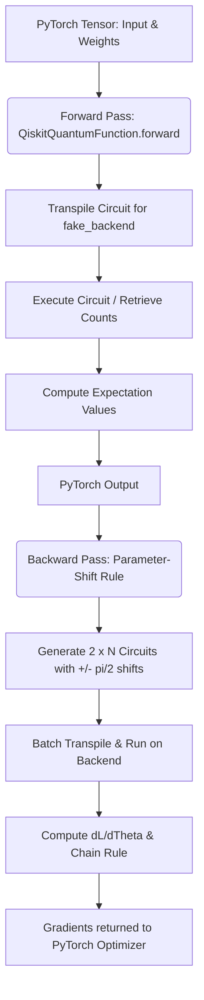

# Quantum Hardware & Backend Transitions in Adversarial QML

This folder contains the codebase and context for evaluating how **Quantum Machine Learning (QML)** models—specifically Hybrid PyTorch-Qiskit Quantum Neural Networks (QNNs)—perform when transitioned across different quantum devices, simulators, and noise profiles.

---

## 1. Directory Context & Objective

The primary script in this folder, [`PGD_Attack_Qiskit_4qubits.py`](file:///home/mms/workspace_qmlsec/qml_cysec/qml/adversarial_pennylane_advanced/change_device/PGD_Attack_Qiskit_4qubits.py), trains a 4-qubit quantum classifier on the `plus-minus` dataset and evaluates its vulnerability to **Projected Gradient Descent (PGD)** adversarial attacks. 

Transitioning QML models across different quantum hardware backends ("changing devices") introduces critical challenges:
1. **Device-Specific Coupling Maps & Gate Sets**: Abstract quantum circuits must be transpiled into physical architectures, which alters circuit depth and CNOT gate counts.
2. **Varying Noise Landscapes**: The error profiles (T1/T2 coherence times, gate fidelity, readout errors) differ drastically across backends, affecting both benign accuracy and adversarial vulnerability.
3. **Execution Overhead**: Noisy simulations or real hardware runs introduce severe computational bottlenecks during gradient calculations.

---

## 2. Qiskit Backend Taxonomy

When transitioning devices, developers can choose from several layers of the Qiskit backend stack:

| Backend Type | Example Class | Noise Profile | Typical Use Case |
| :--- | :--- | :--- | :--- |
| **Ideal Simulator** | `AerSimulator(method='statevector')` | None (Noiseless) | Fast mathematical verification and debugging of gradients. |
| **GPU-Accelerated** | `AerSimulator(device='GPU')` | None / Custom Noise | High-performance simulation for scaled models (e.g., 8+ qubits). |
| **Fake Provider (V2)** | `FakeGuadalupeV2()`, `FakeLimaV2()` | Static Noise (Snapshot of real hardware) | Mimicking physical quantum devices with realistic gate error and readout noise. |
| **Noise-Model Simulator**| `AerSimulator.from_backend(fake_backend)`| Realistic Noise | Running highly parallelized noisy simulations utilizing Aer's C++ speed. |
| **Real Quantum Hardware**| `QiskitRuntimeService` backends | Dynamic Physical Noise | Execution on live physical IBM Quantum QPUs. |

---

## 3. Hybrid PyTorch-Qiskit Autograd & Execution Cost

The integration between **PyTorch** and **Qiskit** is handled via `torch.autograd.Function` inside the class `QiskitQuantumFunction`. 



### The Parameter-Shift Complexity Bottleneck
For a QNN with $L$ layers, $Q$ qubits, and 3 rotation parameters ($R_z(\theta_1), R_y(\theta_2), R_z(\theta_3)$) per qubit layer:
* **Total parameters ($\Theta$)**: $L \times Q \times 3$
* **Gradients via Parameter-Shift**: To compute the gradient of the loss with respect to each parameter, we must evaluate the circuit at $\theta_j + \frac{\pi}{2}$ and $\theta_j - \frac{\pi}{2}$.
* **Execution Count**: $2 \times (L \times Q \times 3)$ circuits.
* **For the 4-qubit, 16-layer model**: 
  $$2 \times (16 \times 4 \times 3) = 384 \text{ circuits per gradient evaluation!}$$

---

## 4. Key Performance Optimizations when Changing Devices

Changing devices often impacts execution times. Use the following techniques to keep runs tractable:

### A. Leverage Aer-Accelerated Fake Backends
Directly calling `fake_backend.run(...)` can be slow. A massive performance boost is achieved by wrapping the fake backend's noise model inside the high-performance C++ `AerSimulator`:
```python
from qiskit_aer import AerSimulator
from qiskit_ibm_runtime.fake_provider import FakeGuadalupeV2

fake_backend = FakeGuadalupeV2()
# Wrap the noise model and coupling map into the high-performance simulator
aer_backend = AerSimulator.from_backend(fake_backend)
```

### B. Configure Parallelism
Always optimize execution threads to exploit multi-core CPUs:
```python
fake_backend.set_options(
    max_parallel_threads=8, 
    max_parallel_experiments=0, # Auto-allocate threads across batch circuits
    method="statevector"        # Or "density_matrix" for noise simulation
)
```

### C. Transpilation Optimization Level
Different devices have different connectivity. Transpile with optimized layout configurations to reduce CNOT overhead:
```python
# Optimization level 3 searches for the optimal physical layout to minimize CNOTs
t_qc = transpile(qc, fake_backend, optimization_level=3)
```

---

## 5. Adversarial Robustness and Transferability

Research in this workspace explores how adversarial robustness changes when migrating between backends:
1. **Transferability across noise regimes**: Adversarial perturbations generated on a noiseless device often fail to fool a model running on a noisy device because physical noise "drowns out" the delicate adversarial perturbations.
2. **Noise-Aware Robustness**: Training a model on a noisy backend (or with hardware-aware noise augmentation) acts as a strong regularizer, yielding decision boundaries that are inherently more robust to both hardware noise and PGD attacks.
